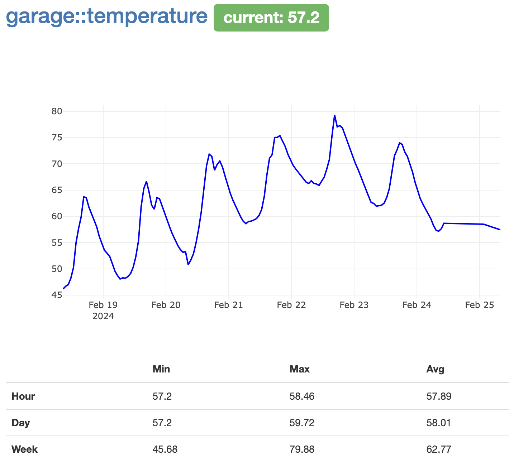

# :hourglass_flowing_sand: cadence

A metrics visualization web UI for [disco.py](https://github.com/collinturney/disco).

## Setup

Install required packages using `pip install -r requirements.txt` and run the included `server.sh` script.
